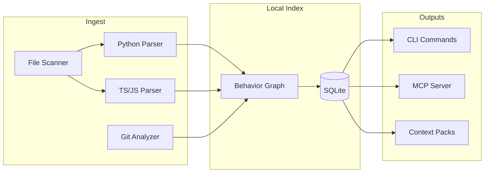

# FlowIndex

Behavior-first repository indexing for AI coding agents.

FlowIndex maps how a codebase behaves: entrypoints, call paths, tests, runtime traces, and git history. It helps AI coding agents understand impact before editing code.

Most coding-agent tools index files, chunks, symbols, or embeddings. FlowIndex indexes behavior.

It answers questions like:

- What code path handles this feature?
- What will break if I change this function?
- Which tests should run for this patch?
- Which previous bug fixes touched this area?
- What minimal context should an agent receive before editing?

## Why behavior-first?

File trees and embedding search tell you what *exists*. They do not tell you what *runs*, what *breaks*, or what *matters* when you change a shared module.

FlowIndex builds a local, deterministic behavior graph:

- **Entrypoints** — API routes, webhooks, pages, CLI commands
- **Call paths** — function-to-function relationships from static analysis
- **Tests** — pytest, Jest/Vitest detection linked to symbols
- **Git history** — co-change patterns and bug-fix commit signals
- **Impact** — transparent risk scoring before you edit

No vector database. No LLM calls. No SaaS. Inspectable SQLite.

## How it differs

| Approach | FlowIndex |
|----------|-----------|
| Repo maps / file trees | Behavior graph with entrypoints and call edges |
| Embeddings / RAG | Deterministic lexical + graph ranking |
| Agent frameworks | Developer tool that feeds agents context |
| Generic static analysis | Agent-oriented impact, tests-for, context packs |

## Installation

```bash
git clone <repo>
cd FlowIndex
pip install -e ".[dev]"
```

Optional MCP support:

```bash
pip install -e ".[mcp]"
```

## Quickstart

```bash
cd your-project
flowindex init
flowindex scan
flowindex overview
flowindex explain "POST /api/payments"
flowindex impact src/services/ledger.py
flowindex tests-for update_ledger
flowindex context "fix duplicate payments when webhook retries"
```

## CLI examples

```bash
# Initialize index in current repo
flowindex init

# Scan and build behavior graph
flowindex scan

# Explain an entrypoint flow
flowindex explain "POST /payments"

# Analyze change impact
flowindex impact services/ledger.py

# Suggest tests for a change
flowindex tests-for services/ledger.py

# Generate agent context pack
flowindex context "fix webhook retry duplicate ledger entries"
```

## MCP usage

```bash
flowindex mcp
```

Connect from Cursor or Claude Code — see [docs/mcp.md](docs/mcp.md).

## Architecture



## Example context pack

```bash
flowindex context "fix duplicate payments when webhook retries"
```

```md
# FlowIndex Context Pack

## Task
fix duplicate payments when webhook retries

## Likely Relevant Entrypoints
- POST /payments
- POST /stripe/webhook

## Likely Relevant Files
- main.py
- services/ledger.py
- services/payments.py

## High-Risk Symbols
- update_ledger()
- handle_stripe_webhook()

## Tests to Run
- tests/test_payments.py

## Caution
- services/ledger.py has high change risk.
- update_ledger() is shared by refunds and payments.
```

## Roadmap

- [ ] Tree-sitter parsers for TS/JS and richer call resolution
- [ ] Runtime trace ingestion (OpenTelemetry, test coverage)
- [ ] Cross-repo dependency indexing
- [ ] Patch-aware incremental scan
- [ ] Language servers: Go, Rust, Java

## Research questions

- How much agent error reduction comes from behavior graphs vs embeddings?
- What is the minimal context pack size that preserves patch correctness?
- Can co-change graphs predict test selection better than import graphs alone?
- Which entrypoint classes correlate most with production incidents?

## Contributing

1. Fork and clone the repository
2. `pip install -e ".[dev]"`
3. Make changes with tests
4. `ruff check . && mypy flowindex && pytest`
5. Open a pull request

See [docs/](docs/) for concepts, CLI reference, and examples.

## License

MIT — see [LICENSE](LICENSE).
